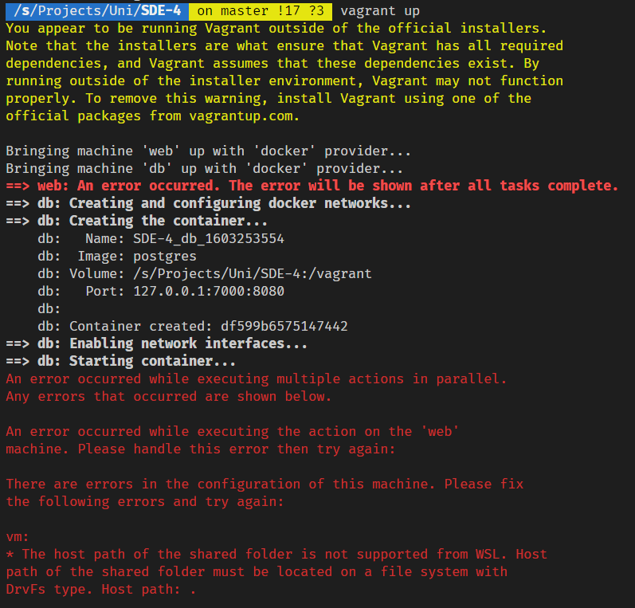
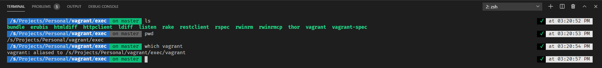
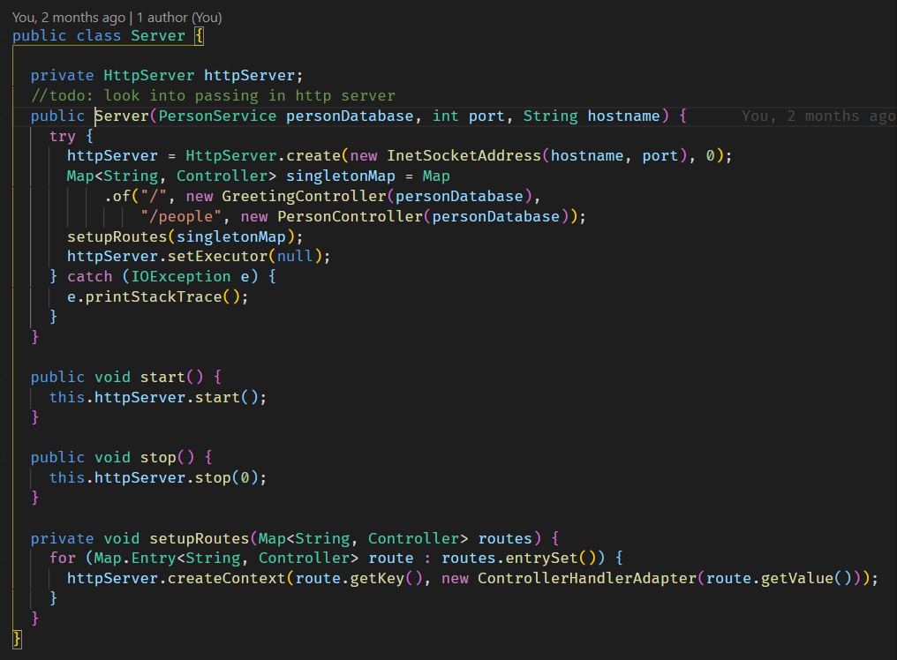
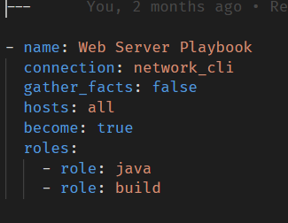
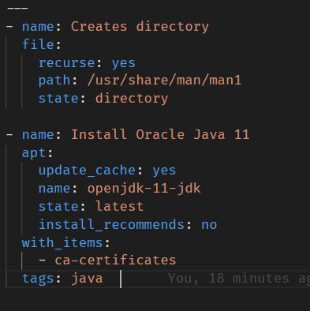
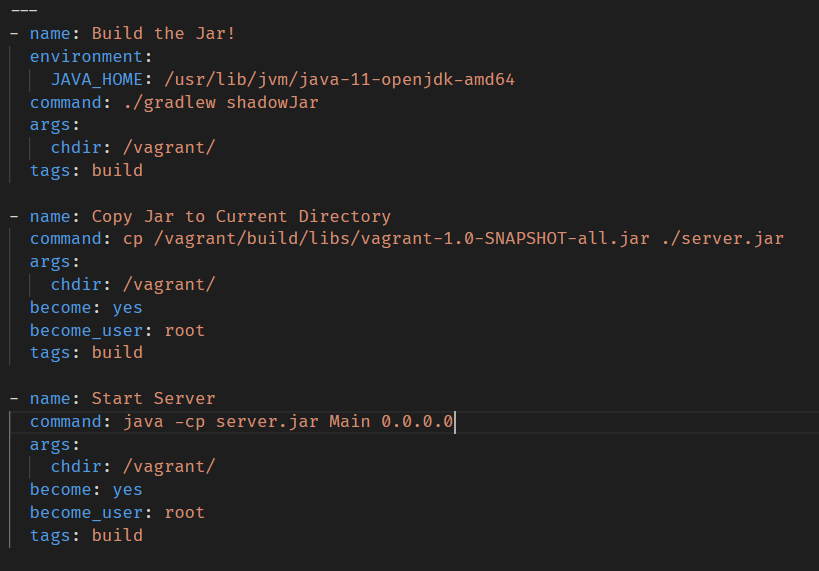
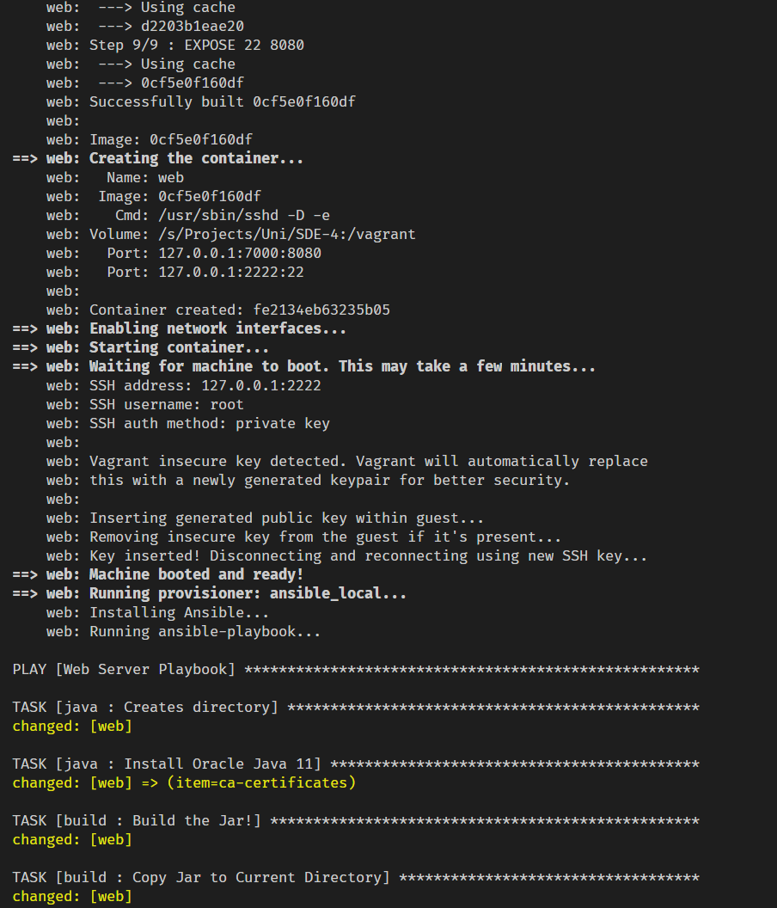
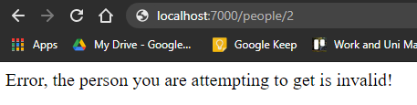

# Task 4: Vagrant and Ansible

**Student Name:** Dominic-Bruno Codespoti

**Student ID:** 102115980

**Unit Details:** SWE30004 Software Deployment and Evolution, Semester 2

**Due Date:** Oct 23 by 23:59

**Declaration of the task level attempted (P/C/D/HD):** HD

# Issues and Fixes

As Vagrant allows for utilizing multiple providers for the VMs they spin up, I chose to use Docker, as it was my prefered choice of the options listed, however I quickly ran into a bug in Vagrant. My development environment utilizes WSL 2, which Vagrant only experimentally supports. As such, I encountered several errors that many other users have also encountered, as shown below:

* [GitHub Issue Example](https://github.com/hashicorp/vagrant/issues/10576)
* [GitHub Issue Example 2](https://github.com/hashicorp/vagrant/issues/11604)
  
I thought maybe this would be a Docker specific issue, however it turns out that all forms of folder syncing are broken in WSL 2, and this is an issue as a good Development environment requires folder syncing so that work can be done on the host device and the changes can dynamically appear in the Development environment hosted on Vagrant. As there is no fix for this bug, I chose to develop one. The first error is shown below in figure 1:


##### **Figure 1:** Vagrant WSL 2 Error

The issue here is Vagrant incorrectly checks for the filesystem used in WSL, as it uses a conditional check like this: 

``` if info && info[:type] == "drvfs" ```

The issue there is that it does not check for the filesystem of the WSL file server, which is [9P](https://en.wikipedia.org/wiki/9P_%28protocol%29). By including this check, we can get passed this issue of Vagrant throwing the exception even though we are in the correct filesystem. The change to the conditional is as below:

``` if info && (info[:type] == "drvfs" || info[:type] == "9p") ```

The next issue is that Vagrant attempts to parse the source file destination as a Windows path. Refer to the code below, where the host string is source on the volume mapping:

              host, guest = v.split(":", 2)	
              host = Vagrant::Util::Platform.windows_path(host)

As WSL 2 is Unix based, it does not parse file locations like Windows, and as such, we can forego this and utilize the unedited host string for the volume mapping, as Docker can read it. As such, I put these two lines in a conditional that only fires off if the conditional in the *if statement* is met:

              if (!ENV["VAGRANT_WSL_ENABLE_WINDOWS_ACCESS"])
                host = Vagrant::Util::Platform.windows_path(host)
                host.gsub!(/^[^A-Za-z]+/, "")
              end

With these changes, Vagrant is able to mount a directory within the host filesystem to Docker. As this is an error many other users of Vagrant have encountered, I opened a pull request with my fixes for others to use here: https://github.com/hashicorp/vagrant/pull/11803

This does not fix the sync issue for other providers, however as I am not using them I did not endeavour to fix them, as this fix works fine for the issue I encountered.

# Credit Requirement

As per the first requirement outlined within the assignment, I began by installing Vagrant. Due to the issues outlined in the earlier part of this paper, I was forced to build my copy of Vagrant from the modified source code. Thankfully, Vagrant has documentation for taking this approach: First, I cloned the Vagrant repository and used it as a base for my work. From there, we can utilize the command ```bundle install``` to install Vagrants Ruby dependencies. With this complete, we are able to run Vagrant utilizing ```bundle exec vagrant```, however to be able to use Vagrant outside of this directory, we can use ```bundle --binstubs exec``` to generate a binstub which we can alias. Figure 2 depict both the binstub and the aliased command:


##### **Figure 2:** Vagrant Setup

The next three steps are quite intertwined, as they all relate to the structure of the Vagrantfile and Dockerfile being used. Firstly, we define two different VMs within the Vagrantfile, with the first pertaining to the Web App portion of the program being deployed.

    config.vm.define 'web', primary: true do |dockerWeb|
      dockerWeb.vm.network :private_network, type: "dhcp"
      dockerWeb.vm.network "forwarded_port", guest: 8080, host: 7000, host_ip: "127.0.0.1", auto_correct: true
      dockerWeb.vm.provider 'docker' do |d|
        d.build_dir = "."
        d.name = "web"
        d.has_ssh = true
        d.remains_running = true
        d.env = {
          "DB_HOST":"db",
          "DB_USER":"postgres",
          "DB_PORT":"5432",
          "DB_NAME":"postgres",
          "DB_PASSWORD":"example",
          "PORT":"8080"
        }
        d.cmd = [
          '/usr/sbin/sshd',
          '-D',
          '-e'
        ]
      end

Below is a break-down of the above code:

* **d.env:** This allows us to set environment variables on the guest device, which we use to specify the connection parameters to the DB.

* **d.has_ssh:** This allows SSH support to work with this container.

* **d.cmd:** This allows us to specify the command that will run upon the containers start.

* **d.remains_running:** This tells Vagrant to wait for the container to start.

* **d.build_dir:** This tells Vagrant to build the Docker image in the current directory.

Furthermore, the following line creates a shared Docker network to allow communication between containers:

    dockerWeb.vm.network :private_network, type: "dhcp"

The second pertaining to the DB that the Web App will talk too.

    config.vm.define 'db' do |dockerDb|
      dockerDb.vm.network :private_network, type: "dhcp"
      dockerDb.vm.provider :docker do |d|
        d.image = 'postgres'
        d.name = "db"
        d.remains_running = true
        d.ports =["5432:5432"]
        d.env = {
          "POSTGRES_USER":"postgres",
          "POSTGRES_PASSWORD":"example"
        }
      end
    end

Below is a break-down of the above code:

* **d.image:** This allows us to specify the image that the container will use as its base.

* **d.ports:** This allows us to expose the DB ports to the host.

Furthermore, the following line connects the container to the shared Docker network to allow communication:

    dockerDb.vm.network :private_network, type: "dhcp"

In-order to generate a SSH keypair for the Web App, we utilize a Dockerfile to get the container ready for hosting an SSH server. The following is the SSH related portion of the Dockerfile that is built as a part of the Vagrantfile:

    RUN apt-get update \
        && apt-get install -y python openssh-server sudo wget curl puppet \
        && apt-get clean

    RUN mkdir -p /root/.ssh
    RUN wget --no-check-certificate https://raw.github.com/mitchellh/vagrant/master/keys/vagrant.pub -O /root/.ssh/authorized_keys  
    RUN chmod 0700 /root/.ssh
    RUN chmod 0600 /root/.ssh/authorized_keys  

    RUN mkdir /var/run/sshd
    RUN sed -i 's/PermitRootLogin prohibit-password/PermitRootLogin yes/' /etc/ssh/sshd_config

    EXPOSE 22 8080

Albeit this is solely the section of code that relates to SSH, it is a large chunk, and as such we will break it down below:

The snippet of code below uses the Debian package manager to install the dependencies required for the project to run.

    RUN apt-get update \
        && apt-get install -y python openssh-server sudo wget curl puppet \
        && apt-get clean

The snippet of code below creates a .ssh directory and then downloads the SSH official Vagrant SSH keys into the newly created directory, saving it as ```authorized keys```. This file is used by SSH services to denote keys that are allowed to connect with the SSH server. Finally, we modify the file permissions to be as restrictive as possible, as per the SSH servers requirements.

    RUN mkdir -p /root/.ssh
    RUN wget --no-check-certificate https://raw.github.com/mitchellh/vagrant/master/keys/vagrant.pub -O /root/.ssh/authorized_keys  
    RUN chmod 0700 /root/.ssh
    RUN chmod 0600 /root/.ssh/authorized_keys  

With this, the Docker container is able to support hosting an accessable SSH server, which we use it to do so as outlined within the Vagrantfile. The next step of installing Ansible within the VM is very simple, as Vagrant can perform such installations automatically with the line below:

    dockerWeb.vm.provision :ansible_local do |ansible|
        ansible.playbook = "ansible/playbook.yml"
        ansible.become = true
      end
    end

The provisioner type ```ansible_local``` automatically installs Ansible within the VM, as opposed to ```ansible``` which utilizes the host device. The final task was to develop a small web app. For this task, I chose to utilize a small ```Hello World API``` developed in Java that I had created earlier last year. Below is a screenshot of the server routes within the Web Server:


##### **Figure 3:** Java Web App Routes  

# High Distinction Requirement

The Vagrantfile above is incomplete in it's current state, as the Ansible provisioner attempts to call the ```playbook.yml``` template which is currently empty. To successfully deploy our Web App and DB, the Java source code must be compiled and run. To do so, we will first create the outline for our Ansible set-up, which is the aforementioned ```playbook.yml``` file, which is shown in figure 4:


##### **Figure 4:** Playbook.yml

The important section of this playbook.yml are the ```roles```, which outline the rest of the template files that will be run sequentially. The first role that will be rune is the Java role, and it's ```main.yml``` can be seen in figure 5 below:


##### **Figure 5:** Java Web App Routes 

As Debian Buster and above come pre-built with the repositories that are needed for OpenJDK 11, we are able to install it without much of a set-up. The only set-up required is the ```Creates directory``` task, which equates to:

    mkdir -p /usr/share/man/man1

This folder needs to exist for the OpenJDK 11 installation to be completed successfully. This step equates to the following command:

    apt-get install openjdk-11-jdk

When this role finishes itself, Ansible continues to the next defined role, which can be seen in figure 6 below:


##### **Figure 6:** Java Web App Routes 

This role is a three step process, and is quite simple. The first step builds a jar using the  gradle ShadowJAR plugin. This plugin creates a FatJar, which means it stores its dependencies internally. This runs the command below with the environment variable for JAVA_HOME being set:

    ./gradlew shadowJar

Once the jar file is built, we then move it into the root directory of the project, and give it an easily understandable name. We do this through the following command:

    cp /vagrant/build/libs/vagrant-1.0-SNAPSHOT-all.jar ./server.jar

Finally, with the jar file in-place, the last step will execute the Main class of the jar with the argument 0.0.0.0, which allows our host machine to access the server via localhost. The command Ansible runs is shown below:

    java -cp server.jar Main 0.0.0.0

With this, running ```vagrant up``` from the projects source directory will bring up both the Web App and the DB, with the former being accessible to the host as shown below in figure 7:


##### **Figure 7:** Extract of Vagrant Up Log

To show that the Web App is working with the DB connected, we attempt to fire a GET request at the route shown above for a resource that does not exist within the DB, which gives us the response below:


##### **Figure 8:** Web App running on localhost, attempting to get invalid resource